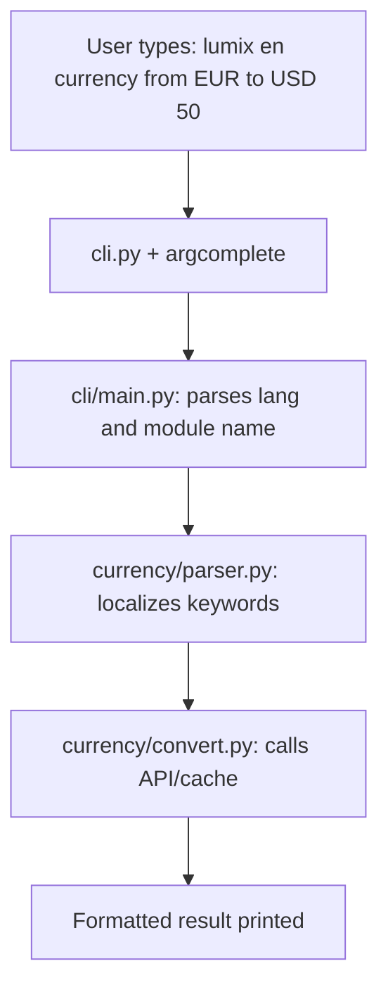

# 🔄 Lumix

**One CLI to convert everything – from temperature to Morse code, in 5 languages.**

[](https://pypi.org/project/lumix/)
[](https://pypi.org/project/lumix/)
[](https://opensource.org/licenses/MIT)
[](https://github.com/psf/black)
[](https://github.com/davideFerigato/lumix/actions/workflows/tests.yml)
[](https://codecov.io/gh/davideFerigato/lumix)
[](https://hub.docker.com/r/davideferigato/lumix)

**Lumix** is a **modular**, **multilingual** command-line converter for physical units, digital data, time, security tools, and creative utilities.  
Designed to be **easily extensible**, it features **shell autocompletion** – all in one sleek package.

🌐 **Supported languages:** English, Italian, French, Spanish, Japanese.  
⚙️ **Modular core:** add your own converters in minutes.  

## 📋 Table of contents

- [✨ Features](#-features)
- [🤔 Why Lumix?](#-why-lumix-instead-of-units-or-qalc)
- [🧱 Architecture overview](#-architecture-overview)
- [📦 Installation](#-installation)
- [🚀 Basic Usage](#-basic-usage)
- [📊 Complete converter reference (30+ categories)](#-complete-converter-reference-30-categories)
- [⏩ Shell Autocompletion](#-shell-autocompletion)
- [🐳 Docker](#-docker)
- [🧪 Testing](#-testing)
- [🤝 Contributing](#-contributing)
- [📄 License](#-license)
- [🙏 Acknowledgements](#-acknowledgements)

---

## ✨ Features

- **🌍 Multilingual by design** – Use Lumix in your native language (en, it, fr, es, jp).
- **🧩 Modular architecture** – Each converter is independent; adding a new one is as simple as creating a new folder.
- **🚀 Rich set of converters** – From physical units to digital data, from time zones to creative tools (see [reference table](#-complete-converter-reference-30-categories)).
- **⌨️ Shell autocompletion** – Works with bash and zsh via `argcomplete`.
- **🐳 Docker‑ready** – Run Lumix anywhere without installing dependencies.
- **🧪 Fully tested** – High test coverage with `pytest`.

---

## 🤔 Why Lumix instead of `units` or `qalc`?

| Feature | Lumix | GNU Units | qalc |
|---------|-------|-----------|------|
| Multilingual CLI (5 languages) | ✅ | ❌ | ❌ |
| 30+ categories out of the box | ✅ | ✅ | ✅ |
| Shell autocompletion | ✅ (argcomplete) | ❌ | ❌ |
| Modular, add your own converter in 5 min | ✅ | ❌ | ❌ |
| Docker image with 0 config | ✅ | ❌ | ❌ |
| Native hashing, IP tools, Morse | ✅ | ❌ | ❌ |
| Open source, Python, easily hackable | ✅ | ❌ | ❌ |

Lumix is **not** just another unit converter – it's a **pluggable framework** for CLI conversions, designed to be extended by developers and used by anyone in their native language.

---

## 🧱 Architecture overview



*Every converter follows the same pattern: `parser.py` → `convert.py` → output.*

---

## 📦 Installation

### From PyPI (recommended)

```bash
pip install lumix
```

### From source

```bash
git clone https://github.com/davideFerigato/lumix.git
cd lumix
python -m venv venv && source venv/bin/activate   # or `venv\Scripts\activate` on Windows
pip install --upgrade pip
pip install -e .
```

---

## 🚀 Basic Usage

```bash
lumix --help
```

Lumix follows a simple pattern:

```bash
lumix <language> <converter> from <source> to <target> <value>
```

For example:

```bash
lumix en temperature from C to F 36.5
lumix it temperatura da C a F 36,5      # Italian uses comma as decimal separator
```

---

## 📊 Complete converter reference (30+ categories)

| Category | Example command | Input units | Output units |
|----------|----------------|-------------|---------------|
| Temperature | `lumix en temperature from C to F 36.5` | C, F, K | C, F, K |
| Currency | `lumix en currency from EUR to USD 50` | EUR, USD, GBP, JPY, ... | EUR, USD, GBP, JPY, ... |
| Number bases | `lumix en base from dec to hex 255` | dec, bin, hex, oct | dec, bin, hex, oct |
| Weight | `lumix en weight from kg to lb 75` | kg, lb, oz, g, mg, st, t | same |
| Length | `lumix en length from m to ft 1.80` | m, km, cm, mm, mi, yd, ft, in, nmi | same |
| Volume | `lumix en volume from l to gal 2` | l, ml, m3, gal, qt, pt, cup, fl oz | same |
| Area | `lumix en area from m2 to ft2 50` | m2, km2, ft2, mi2, ha, acre, cm2, mm2, yd2, in2 | same |
| Speed | `lumix en speed from km/h to mph 130` | km/h, mph, m/s, kn | same |
| Time | `lumix en time from days to hours 3` | s, min, h, d, w | same |
| Energy | `lumix en energy from J to kcal 500` | J, kJ, cal, kcal, Wh, kWh, eV | same |
| Pressure | `lumix en pressure from bar to psi 2` | Pa, bar, atm, mmHg, psi | same |
| Power | `lumix en power from W to hp 1000` | W, kW, hp | same |
| Digital Data | `lumix en data from MB to GB 1500` | B, KB, MB, GB, TB | same |
| Bitrate | `lumix en bitrate from Mbps to Kbps 100` | bps, kbps, Mbps, Gbps, Tbps | same |
| Hash | `lumix en hash sha256 "hello world"` | md5, sha1, sha224, sha256, sha384, sha512 | hash string |
| Color | `lumix en color from rgb to hex 255,255,255` | rgb, hex | rgb, hex |
| IP Tools | `lumix en iptools cidr-to-range 192.168.1.0/24` | CIDR, IP, binary | range, binary, netmask, etc. |
| Time Zones | `lumix en timezones from Europe/Rome to Asia/Tokyo "2025-08-02 14:00"` | any IANA timezone | any IANA timezone |
| Date | `lumix en date from us to iso 08/02/2025` | us, iso, eu, jp | us, iso, eu, jp |
| Calendar | `lumix en calendar diff 2025-01-01 2025-12-31` | YYYY-MM-DD | days |
| Age | `lumix en age from 1990-05-23` | YYYY-MM-DD | years |
| Passwords | `lumix en passwords generate length 16 symbols true` | length, symbols flag | random password |
| Country | `lumix en country from code to name IT` | country code | country name |
| Language | `lumix en language from name to code "Italian"` | language name | ISO code |
| Unit Symbols | `lumix en unitsymbols from W to "unit name"` | symbol or name | symbol, name, type |
| Roman | `lumix en roman from 2025` | 1‑3999 | Roman numeral |
| Morse | `lumix en morse to-text "... --- ..."` | text or Morse | text or Morse |
| Timezone Bot | `lumix en timezonebot what-time Tokyo` | city name | current local time |
| Spoken | `lumix en spoken from 123456` | integer | number in words (en/it) |
| Phonetic | `lumix en phonetic for CIAO` | text | NATO phonetic alphabet |

---

## ⏩ Shell Autocompletion

Lumix integrates with `argcomplete` to provide smart tab completion.

```bash
pip install argcomplete
eval "$(register-python-argcomplete lumix)"
# Add the eval line to your ~/.bashrc or ~/.zshrc to make it permanent
```

> **Note:** Autocompletion is still under active improvement.

---

## 🐳 Docker

Run Lumix in a container without any local installation:

```bash
docker build -t lumix .
docker run --rm lumix en temperature from C to F 36.5
```

---

## 🧪 Testing

We use `pytest` for unit tests. To run the full suite:

```bash
pytest tests/
```

Each module has its own test file (`test_<module>.py`) to ensure reliability.

---

## 🤝 Contributing

Contributions are welcome! Whether you want to add a new converter, improve documentation, or fix a bug, please feel free to open an issue or submit a pull request.

1. Fork the repository.
2. Create a feature branch (`git checkout -b feature/amazing-converter`).
3. Commit your changes (`git commit -m 'Add amazing converter'`).
4. Push to the branch (`git push origin feature/amazing-converter`).
5. Open a Pull Request.
6. Please make sure to update tests as appropriate.

---

## 📄 License

Distributed under the **MIT License**. See `LICENSE` for more information.

---

## 🙏 Acknowledgements

- [Frankfurter API](https://frankfurter.dev) for real‑time exchange rates.
- [argcomplete](https://github.com/kislyuk/argcomplete) for shell completion magic.
- All contributors and users who make this project better.

---

**Happy converting! 🚀**
